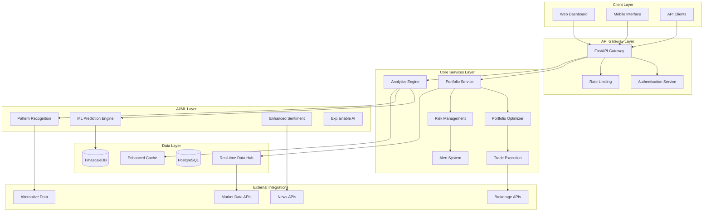

# Design Document

## Overview

This design document outlines the architecture for enhancing the AI Investment Tool with advanced portfolio analytics, real-time monitoring, and intelligent automation. The system will evolve from its current sophisticated foundation into a professional-grade investment management platform while maintaining backward compatibility and leveraging existing components.

The enhancement builds upon the existing FastAPI web server, PostgreSQL database, intelligent caching system, and AI-powered analysis engine to add advanced portfolio optimization, real-time monitoring, automated rebalancing, and comprehensive risk management capabilities.

## Architecture

### High-Level Architecture



### Enhanced Database Schema

The existing database schema will be extended with new tables for advanced analytics:

```sql
-- Portfolio Optimization Tables
CREATE TABLE portfolio_optimizations (
    id UUID PRIMARY KEY DEFAULT gen_random_uuid(),
    portfolio_id UUID REFERENCES portfolios(id),
    optimization_type VARCHAR(50) NOT NULL, -- 'mean_variance', 'risk_parity', 'black_litterman'
    objective_function VARCHAR(50) NOT NULL, -- 'sharpe', 'sortino', 'max_return', 'min_risk'
    constraints JSONB NOT NULL, -- Risk constraints, position limits
    results JSONB NOT NULL, -- Optimal weights, expected return, risk
    efficient_frontier JSONB, -- Points on efficient frontier
    created_at TIMESTAMP WITH TIME ZONE DEFAULT NOW(),
    status VARCHAR(20) DEFAULT 'PENDING'
);

-- Real-time Monitoring Tables
CREATE TABLE portfolio_alerts (
    id UUID PRIMARY KEY DEFAULT gen_random_uuid(),
    portfolio_id UUID REFERENCES portfolios(id),
    alert_type VARCHAR(50) NOT NULL, -- 'price_movement', 'news_event', 'technical_signal'
    severity VARCHAR(20) NOT NULL, -- 'LOW', 'MEDIUM', 'HIGH', 'CRITICAL'
    symbol VARCHAR(20),
    trigger_condition JSONB NOT NULL,
    alert_message TEXT NOT NULL,
    triggered_at TIMESTAMP WITH TIME ZONE DEFAULT NOW(),
    acknowledged_at TIMESTAMP WITH TIME ZONE,
    resolved_at TIMESTAMP WITH TIME ZONE
);

-- Performance Attribution Tables
CREATE TABLE performance_attribution (
    id UUID PRIMARY KEY DEFAULT gen_random_uuid(),
    portfolio_id UUID REFERENCES portfolios(id),
    period_start DATE NOT NULL,
    period_end DATE NOT NULL,
    total_return DECIMAL(10,6),
    benchmark_return DECIMAL(10,6),
    active_return DECIMAL(10,6),
    attribution_by_asset JSONB, -- Asset-level attribution
    attribution_by_sector JSONB, -- Sector-level attribution
    attribution_by_factor JSONB, -- Factor-based attribution
    risk_metrics JSONB, -- VaR, CVaR, Sharpe, etc.
    created_at TIMESTAMP WITH TIME ZONE DEFAULT NOW()
);

-- Rebalancing Tables
CREATE TABLE rebalancing_events (
    id UUID PRIMARY KEY DEFAULT gen_random_uuid(),
    portfolio_id UUID REFERENCES portfolios(id),
    trigger_type VARCHAR(50) NOT NULL, -- 'scheduled', 'threshold', 'volatility'
    target_allocations JSONB NOT NULL,
    current_allocations JSONB NOT NULL,
    recommended_trades JSONB NOT NULL,
    execution_status VARCHAR(20) DEFAULT 'PENDING',
    total_transaction_cost DECIMAL(15,4),
    tax_impact DECIMAL(15,4),
    created_at TIMESTAMP WITH TIME ZONE DEFAULT NOW(),
    executed_at TIMESTAMP WITH TIME ZONE
);

-- ML Model Tables
CREATE TABLE ml_models (
    id UUID PRIMARY KEY DEFAULT gen_random_uuid(),
    model_name VARCHAR(100) NOT NULL,
    model_type VARCHAR(50) NOT NULL, -- 'price_prediction', 'pattern_recognition', 'risk_model'
    model_version VARCHAR(20) NOT NULL,
    training_data_period DATERANGE,
    hyperparameters JSONB,
    performance_metrics JSONB,
    model_artifact_path TEXT,
    is_active BOOLEAN DEFAULT FALSE,
    created_at TIMESTAMP WITH TIME ZONE DEFAULT NOW()
);

-- Time Series Data (using TimescaleDB extension)
CREATE TABLE market_data_timeseries (
    time TIMESTAMPTZ NOT NULL,
    symbol VARCHAR(20) NOT NULL,
    price DECIMAL(15,4),
    volume BIGINT,
    bid DECIMAL(15,4),
    ask DECIMAL(15,4),
    market_cap DECIMAL(20,2),
    volatility DECIMAL(8,6)
);

SELECT create_hypertable('market_data_timeseries', 'time');
```

## Components and Interfaces

### 1. Portfolio Optimization Engine

**Purpose:** Advanced portfolio optimization using modern portfolio theory and alternative optimization methods.

**Key Classes:**
```python
class PortfolioOptimizer:
    def __init__(self, optimization_type: OptimizationType):
        self.optimization_type = optimization_type
        self.constraints = OptimizationConstraints()
    
    def optimize(self, portfolio: Portfolio, market_data: MarketData) -> OptimizationResult:
        """Perform portfolio optimization"""
        pass
    
    def calculate_efficient_frontier(self, assets: List[Asset]) -> EfficientFrontier:
        """Calculate efficient frontier points"""
        pass
    
    def suggest_rebalancing(self, current_weights: Dict, target_weights: Dict) -> RebalancingPlan:
        """Generate rebalancing recommendations"""
        pass

class OptimizationConstraints:
    max_position_size: float
    max_sector_allocation: Dict[str, float]
    min_cash_reserve: float
    transaction_cost_model: TransactionCostModel
    
class OptimizationResult:
    optimal_weights: Dict[str, float]
    expected_return: float
    expected_risk: float
    sharpe_ratio: float
    efficient_frontier: List[Tuple[float, float]]
```

**Integration Points:**
- Integrates with existing Portfolio model
- Uses enhanced market data from real-time data hub
- Connects to rebalancing execution system

### 2. Real-Time Monitoring System

**Purpose:** Continuous monitoring of portfolio performance with intelligent alerting.

**Key Classes:**
```python
class RealTimeMonitor:
    def __init__(self):
        self.alert_engine = AlertEngine()
        self.data_stream = RealTimeDataStream()
    
    def start_monitoring(self, portfolio_id: UUID):
        """Start real-time monitoring for a portfolio"""
        pass
    
    def process_market_update(self, market_data: MarketUpdate):
        """Process incoming market data and check alert conditions"""
        pass

class AlertEngine:
    def __init__(self):
        self.alert_rules = AlertRuleManager()
        self.notification_service = NotificationService()
    
    def evaluate_alerts(self, portfolio: Portfolio, market_data: MarketData) -> List[Alert]:
        """Evaluate all alert conditions"""
        pass
    
    def send_alert(self, alert: Alert):
        """Send alert via configured channels"""
        pass

class AlertRule:
    rule_type: AlertType
    condition: AlertCondition
    severity: AlertSeverity
    notification_channels: List[NotificationChannel]
```

**Integration Points:**
- Extends existing notification system
- Uses WebSocket connections for real-time updates
- Integrates with mobile push notification service

### 3. Advanced Backtesting Engine

**Purpose:** Comprehensive backtesting with performance attribution and statistical analysis.

**Key Classes:**
```python
class AdvancedBacktester:
    def __init__(self):
        self.performance_calculator = PerformanceCalculator()
        self.attribution_engine = AttributionEngine()
        self.risk_calculator = RiskCalculator()
    
    def run_backtest(self, strategy: Strategy, start_date: date, end_date: date) -> BacktestResult:
        """Run comprehensive backtest"""
        pass
    
    def monte_carlo_simulation(self, strategy: Strategy, num_simulations: int) -> MonteCarloResult:
        """Run Monte Carlo simulation"""
        pass

class PerformanceCalculator:
    def calculate_returns(self, portfolio_values: TimeSeries) -> PerformanceMetrics:
        """Calculate comprehensive performance metrics"""
        pass
    
    def calculate_attribution(self, portfolio: Portfolio, benchmark: Benchmark) -> Attribution:
        """Calculate performance attribution"""
        pass

class RiskCalculator:
    def calculate_var(self, returns: TimeSeries, confidence_level: float) -> float:
        """Calculate Value at Risk"""
        pass
    
    def calculate_cvar(self, returns: TimeSeries, confidence_level: float) -> float:
        """Calculate Conditional Value at Risk"""
        pass
    
    def stress_test(self, portfolio: Portfolio, scenarios: List[StressScenario]) -> StressTestResult:
        """Perform stress testing"""
        pass
```

**Integration Points:**
- Extends existing BacktestEngine
- Uses TimescaleDB for efficient time series queries
- Integrates with ML models for predictive backtesting

### 4. ML-Enhanced Analytics Engine

**Purpose:** Advanced machine learning capabilities for pattern recognition and prediction.

**Key Classes:**
```python
class MLAnalyticsEngine:
    def __init__(self):
        self.model_manager = MLModelManager()
        self.feature_engineer = FeatureEngineer()
        self.explainer = ExplainableAI()
    
    def predict_price_movement(self, symbol: str, horizon: int) -> PredictionResult:
        """Predict price movements with confidence intervals"""
        pass
    
    def detect_patterns(self, market_data: MarketData) -> List[Pattern]:
        """Detect trading patterns and anomalies"""
        pass
    
    def generate_insights(self, portfolio: Portfolio) -> List[Insight]:
        """Generate AI-powered investment insights"""
        pass

class MLModelManager:
    def train_model(self, model_type: ModelType, training_data: DataFrame) -> MLModel:
        """Train new ML model"""
        pass
    
    def evaluate_model(self, model: MLModel, test_data: DataFrame) -> ModelMetrics:
        """Evaluate model performance"""
        pass
    
    def deploy_model(self, model: MLModel) -> bool:
        """Deploy model to production"""
        pass

class ExplainableAI:
    def explain_prediction(self, model: MLModel, input_data: DataFrame) -> Explanation:
        """Provide explanation for model predictions"""
        pass
    
    def feature_importance(self, model: MLModel) -> Dict[str, float]:
        """Calculate feature importance"""
        pass
```

**Integration Points:**
- Extends existing AI analyzer
- Uses MLflow for model versioning and deployment
- Integrates with existing caching system for model predictions

### 5. Trade Execution System

**Purpose:** Automated trade execution with smart order routing and cost optimization.

**Key Classes:**
```python
class TradeExecutionEngine:
    def __init__(self):
        self.broker_manager = BrokerManager()
        self.order_optimizer = OrderOptimizer()
        self.execution_monitor = ExecutionMonitor()
    
    def execute_rebalancing(self, rebalancing_plan: RebalancingPlan) -> ExecutionResult:
        """Execute rebalancing trades"""
        pass
    
    def optimize_execution(self, trades: List[Trade]) -> OptimizedOrderList:
        """Optimize trade execution for minimal market impact"""
        pass

class BrokerManager:
    def __init__(self):
        self.brokers = {}  # Multiple broker integrations
    
    def place_order(self, order: Order, broker: str) -> OrderResult:
        """Place order with specified broker"""
        pass
    
    def get_account_info(self, broker: str) -> AccountInfo:
        """Get account information"""
        pass

class OrderOptimizer:
    def optimize_order_timing(self, order: Order, market_conditions: MarketConditions) -> OptimalTiming:
        """Optimize order timing based on market conditions"""
        pass
    
    def calculate_market_impact(self, order: Order) -> MarketImpactEstimate:
        """Estimate market impact of order"""
        pass
```

**Integration Points:**
- Integrates with existing transaction tracking
- Connects to multiple brokerage APIs
- Uses real-time market data for execution optimization

## Data Models

### Enhanced Portfolio Model

```python
@dataclass
class EnhancedPortfolio:
    # Existing fields from current Portfolio model
    id: UUID
    user_id: UUID
    name: str
    description: str
    total_value: Decimal
    cash_balance: Decimal
    
    # New optimization fields
    optimization_settings: OptimizationSettings
    rebalancing_rules: RebalancingRules
    risk_constraints: RiskConstraints
    
    # Performance tracking
    performance_metrics: PerformanceMetrics
    attribution_data: AttributionData
    
    # Real-time monitoring
    alert_rules: List[AlertRule]
    monitoring_enabled: bool
    
    # ML insights
    ai_insights: List[AIInsight]
    prediction_models: List[str]  # Model IDs

@dataclass
class OptimizationSettings:
    optimization_type: OptimizationType
    objective_function: ObjectiveFunction
    rebalancing_frequency: RebalancingFrequency
    transaction_cost_model: TransactionCostModel
    tax_optimization: bool

@dataclass
class RiskConstraints:
    max_position_size: float
    max_sector_allocation: Dict[str, float]
    max_volatility: float
    max_drawdown: float
    var_limit: float
```

### Real-Time Data Models

```python
@dataclass
class MarketUpdate:
    timestamp: datetime
    symbol: str
    price: Decimal
    volume: int
    bid: Decimal
    ask: Decimal
    market_cap: Decimal
    volatility: float
    
@dataclass
class Alert:
    id: UUID
    portfolio_id: UUID
    alert_type: AlertType
    severity: AlertSeverity
    symbol: Optional[str]
    message: str
    triggered_at: datetime
    data: Dict[str, Any]
    
@dataclass
class PredictionResult:
    symbol: str
    prediction_horizon: int
    predicted_price: float
    confidence_interval: Tuple[float, float]
    probability_up: float
    model_confidence: float
    explanation: str
```

## Error Handling

### Comprehensive Error Management

```python
class PortfolioAnalyticsError(Exception):
    """Base exception for portfolio analytics errors"""
    pass

class OptimizationError(PortfolioAnalyticsError):
    """Errors in portfolio optimization"""
    pass

class RealTimeDataError(PortfolioAnalyticsError):
    """Errors in real-time data processing"""
    pass

class MLModelError(PortfolioAnalyticsError):
    """Errors in ML model operations"""
    pass

class ExecutionError(PortfolioAnalyticsError):
    """Errors in trade execution"""
    pass

# Error handling strategy
class ErrorHandler:
    def __init__(self):
        self.logger = logging.getLogger(__name__)
        self.alert_service = AlertService()
    
    def handle_optimization_error(self, error: OptimizationError, portfolio_id: UUID):
        """Handle optimization errors with fallback strategies"""
        self.logger.error(f"Optimization failed for portfolio {portfolio_id}: {error}")
        # Fallback to simple rebalancing
        # Alert user about optimization failure
        
    def handle_realtime_data_error(self, error: RealTimeDataError):
        """Handle real-time data errors with graceful degradation"""
        self.logger.warning(f"Real-time data error: {error}")
        # Switch to cached data
        # Reduce update frequency
        
    def handle_ml_model_error(self, error: MLModelError, model_id: str):
        """Handle ML model errors with model fallback"""
        self.logger.error(f"ML model {model_id} failed: {error}")
        # Switch to backup model
        # Disable problematic model
```

## Testing Strategy

### Comprehensive Testing Approach

1. **Unit Testing**
   - Test all optimization algorithms with known datasets
   - Test ML model training and prediction accuracy
   - Test real-time data processing components
   - Test alert rule evaluation logic

2. **Integration Testing**
   - Test end-to-end portfolio optimization workflow
   - Test real-time monitoring with simulated market data
   - Test brokerage API integrations with sandbox environments
   - Test database performance with large datasets

3. **Performance Testing**
   - Load testing for real-time data processing
   - Stress testing for optimization algorithms
   - Latency testing for alert system
   - Database query performance testing

4. **Backtesting Validation**
   - Validate backtesting engine against known historical results
   - Test performance attribution calculations
   - Validate risk metric calculations
   - Test Monte Carlo simulation accuracy

5. **ML Model Testing**
   - Cross-validation for prediction models
   - Out-of-sample testing for model generalization
   - A/B testing for model performance comparison
   - Bias and fairness testing for AI recommendations

### Test Implementation

```python
class TestPortfolioOptimizer(unittest.TestCase):
    def setUp(self):
        self.optimizer = PortfolioOptimizer(OptimizationType.MEAN_VARIANCE)
        self.test_portfolio = create_test_portfolio()
        self.test_market_data = load_test_market_data()
    
    def test_mean_variance_optimization(self):
        """Test mean-variance optimization with known results"""
        result = self.optimizer.optimize(self.test_portfolio, self.test_market_data)
        self.assertAlmostEqual(result.sharpe_ratio, expected_sharpe_ratio, places=2)
        self.assertTrue(sum(result.optimal_weights.values()) == 1.0)
    
    def test_efficient_frontier_calculation(self):
        """Test efficient frontier calculation"""
        frontier = self.optimizer.calculate_efficient_frontier(self.test_assets)
        self.assertTrue(len(frontier.points) > 10)
        self.assertTrue(all(point.risk >= 0 for point in frontier.points))

class TestRealTimeMonitoring(unittest.TestCase):
    def setUp(self):
        self.monitor = RealTimeMonitor()
        self.test_portfolio = create_test_portfolio()
    
    def test_alert_generation(self):
        """Test alert generation for price movements"""
        market_update = MarketUpdate(
            symbol="AAPL",
            price=Decimal("150.00"),
            timestamp=datetime.now()
        )
        alerts = self.monitor.process_market_update(market_update)
        self.assertIsInstance(alerts, list)
    
    @patch('real_time_monitor.WebSocketClient')
    def test_websocket_connection(self, mock_websocket):
        """Test WebSocket connection handling"""
        self.monitor.start_monitoring(self.test_portfolio.id)
        mock_websocket.assert_called_once()
```

This design provides a comprehensive foundation for implementing advanced portfolio analytics while building upon your existing sophisticated system. The modular architecture ensures maintainability and allows for incremental implementation of features.