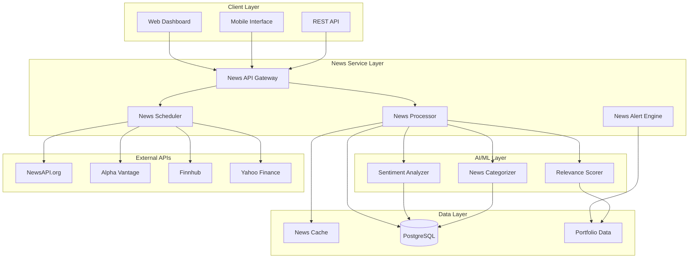

# Design Document

## Overview

This design document outlines the architecture for integrating a comprehensive stock news system into the existing AI Investment Tool. The system will provide automated news fetching, intelligent categorization, sentiment analysis, and seamless integration with the existing portfolio management system.

**Integration with Existing System:**
- Leverages existing FastAPI web server and PostgreSQL database
- Extends current caching system (NewsSentimentCache) with enhanced news storage
- Integrates with existing portfolio models and user management
- Uses existing notification infrastructure for news alerts
- Builds upon current AI analysis capabilities for sentiment processing

## Architecture

### High-Level Architecture



### Enhanced Database Schema

Building upon the existing database schema, we'll add new tables for comprehensive news management:

```sql
-- News Articles Table
CREATE TABLE news_articles (
    id UUID PRIMARY KEY DEFAULT gen_random_uuid(),
    title VARCHAR(500) NOT NULL,
    description TEXT,
    content TEXT,
    url VARCHAR(1000) NOT NULL,
    url_to_image VARCHAR(1000),
    source_name VARCHAR(100) NOT NULL,
    source_id VARCHAR(50),
    author VARCHAR(200),
    published_at TIMESTAMP WITH TIME ZONE NOT NULL,
    content_hash VARCHAR(64) UNIQUE, -- For deduplication
    created_at TIMESTAMP WITH TIME ZONE DEFAULT NOW(),
    updated_at TIMESTAMP WITH TIME ZONE DEFAULT NOW()
);

-- News Categories and Classification
CREATE TABLE news_categories (
    id UUID PRIMARY KEY DEFAULT gen_random_uuid(),
    article_id UUID REFERENCES news_articles(id) ON DELETE CASCADE,
    category_type VARCHAR(50) NOT NULL, -- 'primary', 'sector', 'custom'
    category_value VARCHAR(100) NOT NULL, -- 'earnings', 'technology', etc.
    confidence_score DECIMAL(3,2), -- 0.00 to 1.00
    created_at TIMESTAMP WITH TIME ZONE DEFAULT NOW()
);

-- News Sentiment Analysis
CREATE TABLE news_sentiment (
    id UUID PRIMARY KEY DEFAULT gen_random_uuid(),
    article_id UUID REFERENCES news_articles(id) ON DELETE CASCADE,
    sentiment VARCHAR(20) NOT NULL, -- 'positive', 'negative', 'neutral'
    sentiment_score DECIMAL(4,3), -- -1.000 to 1.000
    confidence_score DECIMAL(3,2), -- 0.00 to 1.00
    impact_level VARCHAR(20), -- 'high', 'medium', 'low'
    keywords JSONB, -- Extracted keywords and their weights
    created_at TIMESTAMP WITH TIME ZONE DEFAULT NOW()
);

-- Stock-News Relationships
CREATE TABLE stock_news_relevance (
    id UUID PRIMARY KEY DEFAULT gen_random_uuid(),
    article_id UUID REFERENCES news_articles(id) ON DELETE CASCADE,
    symbol VARCHAR(20) NOT NULL,
    relevance_score DECIMAL(4,3) NOT NULL, -- 0.000 to 1.000
    mention_count INTEGER DEFAULT 1,
    context_type VARCHAR(50), -- 'direct_mention', 'sector_related', 'competitor'
    created_at TIMESTAMP WITH TIME ZONE DEFAULT NOW(),
    UNIQUE(article_id, symbol)
);

-- News Sources Management
CREATE TABLE news_sources (
    id UUID PRIMARY KEY DEFAULT gen_random_uuid(),
    source_id VARCHAR(50) UNIQUE NOT NULL,
    name VARCHAR(100) NOT NULL,
    description TEXT,
    url VARCHAR(500),
    category VARCHAR(50),
    language VARCHAR(10),
    country VARCHAR(10),
    quality_score DECIMAL(3,2) DEFAULT 0.50, -- 0.00 to 1.00
    is_active BOOLEAN DEFAULT TRUE,
    api_provider VARCHAR(50), -- 'newsapi', 'alpha_vantage', 'finnhub'
    created_at TIMESTAMP WITH TIME ZONE DEFAULT NOW(),
    updated_at TIMESTAMP WITH TIME ZONE DEFAULT NOW()
);

-- User News Preferences
CREATE TABLE user_news_preferences (
    id UUID PRIMARY KEY DEFAULT gen_random_uuid(),
    user_id UUID REFERENCES users(id) ON DELETE CASCADE,
    categories JSONB, -- Preferred categories and weights
    sources JSONB, -- Preferred/blocked sources
    sentiment_threshold DECIMAL(3,2) DEFAULT 0.30,
    impact_threshold VARCHAR(20) DEFAULT 'medium',
    notification_settings JSONB,
    refresh_frequency INTEGER DEFAULT 60, -- minutes
    created_at TIMESTAMP WITH TIME ZONE DEFAULT NOW(),
    updated_at TIMESTAMP WITH TIME ZONE DEFAULT NOW(),
    UNIQUE(user_id)
);

-- News Fetch Jobs and Scheduling
CREATE TABLE news_fetch_jobs (
    id UUID PRIMARY KEY DEFAULT gen_random_uuid(),
    job_type VARCHAR(50) NOT NULL, -- 'scheduled', 'manual', 'portfolio_triggered'
    user_id UUID REFERENCES users(id),
    portfolio_id UUID REFERENCES portfolios(id),
    symbols JSONB, -- Array of symbols to fetch news for
    status VARCHAR(20) DEFAULT 'pending', -- 'pending', 'running', 'completed', 'failed'
    api_provider VARCHAR(50),
    articles_fetched INTEGER DEFAULT 0,
    api_calls_made INTEGER DEFAULT 0,
    started_at TIMESTAMP WITH TIME ZONE,
    completed_at TIMESTAMP WITH TIME ZONE,
    error_message TEXT,
    created_at TIMESTAMP WITH TIME ZONE DEFAULT NOW()
);

-- Indexes for performance
CREATE INDEX idx_news_articles_published_at ON news_articles(published_at DESC);
CREATE INDEX idx_news_articles_source ON news_articles(source_name);
CREATE INDEX idx_news_articles_content_hash ON news_articles(content_hash);
CREATE INDEX idx_stock_news_relevance_symbol ON stock_news_relevance(symbol);
CREATE INDEX idx_stock_news_relevance_score ON stock_news_relevance(relevance_score DESC);
CREATE INDEX idx_news_sentiment_sentiment ON news_sentiment(sentiment);
CREATE INDEX idx_news_categories_category ON news_categories(category_type, category_value);
```

## Components and Interfaces

### 1. News API Gateway

**Purpose:** Centralized interface for managing multiple news data providers with intelligent fallback and rate limiting.

**Key Classes:**
```python
class NewsAPIGateway:
    def __init__(self):
        self.providers = {
            'newsapi': NewsAPIProvider(),
            'alpha_vantage': AlphaVantageProvider(),
            'finnhub': FinnhubProvider(),
            'yahoo': YahooFinanceProvider()
        }
        self.rate_limiter = RateLimiter()
        self.fallback_manager = FallbackManager()
    
    def fetch_news(self, symbols: List[str], provider: str = None) -> List[NewsArticle]:
        """Fetch news with automatic fallback"""
        pass
    
    def get_available_providers(self) -> List[str]:
        """Get list of available and healthy providers"""
        pass

class NewsProvider(ABC):
    @abstractmethod
    def fetch_news_for_symbol(self, symbol: str, limit: int = 50) -> List[NewsArticle]:
        """Fetch news for a specific symbol"""
        pass
    
    @abstractmethod
    def get_rate_limit_status(self) -> RateLimitStatus:
        """Get current rate limit status"""
        pass

class NewsAPIProvider(NewsProvider):
    def __init__(self, api_key: str):
        self.client = NewsApiClient(api_key=api_key)
        self.rate_limiter = RateLimiter(requests_per_day=1000)
    
    def fetch_news_for_symbol(self, symbol: str, limit: int = 50) -> List[NewsArticle]:
        """Fetch news using NewsAPI.org"""
        try:
            response = self.client.get_everything(
                q=f'"{symbol}" OR "{self._get_company_name(symbol)}"',
                language='en',
                sort_by='publishedAt',
                page_size=min(limit, 100)
            )
            return self._parse_response(response)
        except Exception as e:
            raise NewsProviderError(f"NewsAPI error: {e}")
```

**Integration Points:**
- Uses existing environment configuration for API keys
- Integrates with existing error handling and logging systems
- Connects to enhanced caching system

### 2. News Processing Engine

**Purpose:** Process, analyze, and categorize news articles with AI-powered sentiment analysis and relevance scoring.

**Key Classes:**
```python
class NewsProcessor:
    def __init__(self):
        self.sentiment_analyzer = SentimentAnalyzer()
        self.categorizer = NewsCategorizer()
        self.relevance_scorer = RelevanceScorer()
        self.deduplicator = NewsDeduplicator()
    
    def process_articles(self, articles: List[RawNewsArticle]) -> List[ProcessedNewsArticle]:
        """Process raw articles through the full pipeline"""
        processed = []
        for article in articles:
            if not self.deduplicator.is_duplicate(article):
                processed_article = self._process_single_article(article)
                processed.append(processed_article)
        return processed
    
    def _process_single_article(self, article: RawNewsArticle) -> ProcessedNewsArticle:
        """Process a single article"""
        # Sentiment analysis
        sentiment = self.sentiment_analyzer.analyze(article.title, article.content)
        
        # Categorization
        categories = self.categorizer.categorize(article)
        
        # Relevance scoring for stocks
        relevance_scores = self.relevance_scorer.score_relevance(article)
        
        return ProcessedNewsArticle(
            raw_article=article,
            sentiment=sentiment,
            categories=categories,
            relevance_scores=relevance_scores
        )

class SentimentAnalyzer:
    def __init__(self):
        # Use existing AI capabilities or integrate with external services
        self.model = self._load_sentiment_model()
    
    def analyze(self, title: str, content: str) -> SentimentResult:
        """Analyze sentiment of news article"""
        combined_text = f"{title}. {content[:500]}"  # Limit for API efficiency
        
        # Use existing AI analysis or external service
        sentiment_score = self.model.predict_sentiment(combined_text)
        
        return SentimentResult(
            sentiment=self._classify_sentiment(sentiment_score),
            score=sentiment_score,
            confidence=self._calculate_confidence(sentiment_score),
            impact_level=self._assess_impact(title, content)
        )

class NewsCategorizer:
    def __init__(self):
        self.category_keywords = self._load_category_keywords()
        self.sector_classifier = SectorClassifier()
    
    def categorize(self, article: RawNewsArticle) -> List[CategoryResult]:
        """Categorize news article"""
        categories = []
        
        # Primary category (earnings, M&A, etc.)
        primary_category = self._classify_primary_category(article)
        if primary_category:
            categories.append(primary_category)
        
        # Sector classification
        sector_category = self.sector_classifier.classify(article)
        if sector_category:
            categories.append(sector_category)
        
        return categories

class RelevanceScorer:
    def __init__(self):
        self.portfolio_service = PortfolioService()
    
    def score_relevance(self, article: RawNewsArticle) -> Dict[str, float]:
        """Score article relevance for different stocks"""
        relevance_scores = {}
        
        # Extract mentioned symbols and companies
        mentioned_entities = self._extract_financial_entities(article)
        
        for entity in mentioned_entities:
            score = self._calculate_relevance_score(article, entity)
            if score > 0.1:  # Minimum relevance threshold
                relevance_scores[entity.symbol] = score
        
        return relevance_scores
```

**Integration Points:**
- Extends existing AI analysis capabilities
- Uses existing database models and services
- Integrates with portfolio data for relevance scoring

### 3. News Scheduler and Job Manager

**Purpose:** Manage automated news fetching with intelligent scheduling and cost optimization.

**Key Classes:**
```python
class NewsScheduler:
    def __init__(self):
        self.job_queue = JobQueue()
        self.cost_optimizer = CostOptimizer()
        self.market_hours = MarketHoursManager()
    
    def schedule_portfolio_news_update(self, portfolio_id: UUID, user_preferences: UserNewsPreferences):
        """Schedule news updates for a portfolio"""
        symbols = self._get_portfolio_symbols(portfolio_id)
        
        # Optimize scheduling based on market hours and preferences
        schedule = self.cost_optimizer.optimize_schedule(
            symbols=symbols,
            preferences=user_preferences,
            market_hours=self.market_hours.get_current_session()
        )
        
        job = NewsFetchJob(
            job_type='scheduled',
            portfolio_id=portfolio_id,
            symbols=symbols,
            schedule=schedule
        )
        
        self.job_queue.add_job(job)
    
    def trigger_manual_refresh(self, user_id: UUID, symbols: List[str] = None) -> str:
        """Trigger immediate manual news refresh"""
        job = NewsFetchJob(
            job_type='manual',
            user_id=user_id,
            symbols=symbols or self._get_user_symbols(user_id),
            priority='high'
        )
        
        return self.job_queue.add_job(job)

class CostOptimizer:
    def __init__(self):
        self.api_costs = self._load_api_cost_matrix()
        self.usage_tracker = APIUsageTracker()
    
    def optimize_schedule(self, symbols: List[str], preferences: UserNewsPreferences, 
                         market_hours: MarketSession) -> ScheduleOptimization:
        """Optimize news fetching schedule for cost efficiency"""
        
        # Increase frequency during market hours
        base_frequency = preferences.refresh_frequency
        if market_hours.is_trading_hours():
            frequency = max(base_frequency // 2, 15)  # Minimum 15 minutes
        else:
            frequency = min(base_frequency * 2, 240)  # Maximum 4 hours
        
        # Batch symbols to minimize API calls
        batched_symbols = self._batch_symbols_by_provider(symbols)
        
        return ScheduleOptimization(
            frequency_minutes=frequency,
            batched_requests=batched_symbols,
            estimated_cost=self._calculate_estimated_cost(batched_symbols, frequency)
        )

class JobQueue:
    def __init__(self):
        self.redis_client = redis.Redis()  # Optional: use Redis for job queue
        self.background_tasks = BackgroundTasks()
    
    def add_job(self, job: NewsFetchJob) -> str:
        """Add job to queue and return job ID"""
        job_id = str(uuid.uuid4())
        
        # Store job in database
        self._store_job(job_id, job)
        
        # Schedule background execution
        self.background_tasks.add_task(self._execute_job, job_id)
        
        return job_id
    
    async def _execute_job(self, job_id: str):
        """Execute news fetch job"""
        job = self._get_job(job_id)
        
        try:
            job.status = 'running'
            job.started_at = datetime.utcnow()
            self._update_job(job)
            
            # Execute the actual news fetching
            news_gateway = NewsAPIGateway()
            articles = news_gateway.fetch_news(job.symbols)
            
            # Process articles
            processor = NewsProcessor()
            processed_articles = processor.process_articles(articles)
            
            # Store in database
            self._store_articles(processed_articles)
            
            job.status = 'completed'
            job.articles_fetched = len(processed_articles)
            job.completed_at = datetime.utcnow()
            
        except Exception as e:
            job.status = 'failed'
            job.error_message = str(e)
            
        finally:
            self._update_job(job)
```

**Integration Points:**
- Uses existing background task system
- Integrates with existing portfolio and user models
- Connects to existing market session tracking

### 4. News Alert Engine

**Purpose:** Generate intelligent alerts based on news events and user preferences.

**Key Classes:**
```python
class NewsAlertEngine:
    def __init__(self):
        self.notification_service = NotificationService()  # Existing service
        self.alert_rules = AlertRuleEngine()
    
    def evaluate_news_alerts(self, articles: List[ProcessedNewsArticle], user_id: UUID):
        """Evaluate articles against user's alert rules"""
        user_preferences = self._get_user_preferences(user_id)
        portfolio_holdings = self._get_user_holdings(user_id)
        
        alerts = []
        for article in articles:
            alert = self.alert_rules.evaluate_article(
                article, user_preferences, portfolio_holdings
            )
            if alert:
                alerts.append(alert)
        
        # Send alerts through existing notification system
        for alert in alerts:
            self.notification_service.send_alert(alert)
    
    def create_breaking_news_alert(self, article: ProcessedNewsArticle) -> NewsAlert:
        """Create alert for breaking news"""
        return NewsAlert(
            alert_type='breaking_news',
            severity=self._determine_severity(article),
            title=f"Breaking: {article.title[:50]}...",
            message=article.description,
            article_id=article.id,
            symbols=list(article.relevance_scores.keys()),
            created_at=datetime.utcnow()
        )

class AlertRuleEngine:
    def __init__(self):
        self.rules = self._load_default_rules()
    
    def evaluate_article(self, article: ProcessedNewsArticle, 
                        preferences: UserNewsPreferences,
                        holdings: List[Holding]) -> Optional[NewsAlert]:
        """Evaluate if article should trigger an alert"""
        
        # Check if article is relevant to user's holdings
        relevant_symbols = self._get_relevant_symbols(article, holdings)
        if not relevant_symbols:
            return None
        
        # Check sentiment threshold
        if abs(article.sentiment.score) < preferences.sentiment_threshold:
            return None
        
        # Check impact level
        if not self._meets_impact_threshold(article, preferences.impact_threshold):
            return None
        
        # Create alert
        return NewsAlert(
            alert_type='portfolio_news',
            severity=self._calculate_severity(article, relevant_symbols, holdings),
            title=f"News Alert: {', '.join(relevant_symbols)}",
            message=article.title,
            article_id=article.id,
            symbols=relevant_symbols,
            sentiment=article.sentiment.sentiment,
            impact_level=article.sentiment.impact_level
        )
```

**Integration Points:**
- Uses existing notification infrastructure
- Integrates with existing portfolio and holdings data
- Extends existing alert system

## Data Models

### Core News Models

```python
@dataclass
class NewsArticle:
    id: UUID
    title: str
    description: Optional[str]
    content: Optional[str]
    url: str
    url_to_image: Optional[str]
    source_name: str
    source_id: Optional[str]
    author: Optional[str]
    published_at: datetime
    content_hash: str
    created_at: datetime
    updated_at: datetime

@dataclass
class ProcessedNewsArticle(NewsArticle):
    sentiment: SentimentResult
    categories: List[CategoryResult]
    relevance_scores: Dict[str, float]  # symbol -> relevance score

@dataclass
class SentimentResult:
    sentiment: str  # 'positive', 'negative', 'neutral'
    score: float  # -1.0 to 1.0
    confidence: float  # 0.0 to 1.0
    impact_level: str  # 'high', 'medium', 'low'
    keywords: List[str]

@dataclass
class CategoryResult:
    category_type: str  # 'primary', 'sector', 'custom'
    category_value: str
    confidence_score: float

@dataclass
class UserNewsPreferences:
    user_id: UUID
    categories: Dict[str, float]  # category -> weight
    sources: Dict[str, bool]  # source -> enabled/disabled
    sentiment_threshold: float
    impact_threshold: str
    notification_settings: Dict[str, Any]
    refresh_frequency: int  # minutes

@dataclass
class NewsAlert:
    alert_type: str
    severity: str
    title: str
    message: str
    article_id: UUID
    symbols: List[str]
    sentiment: Optional[str] = None
    impact_level: Optional[str] = None
    created_at: datetime = field(default_factory=datetime.utcnow)
```

### API Response Models

```python
class NewsListResponse(BaseModel):
    articles: List[NewsArticle]
    total_count: int
    page: int
    page_size: int
    filters_applied: Dict[str, Any]

class NewsCategoriesResponse(BaseModel):
    categories: Dict[str, int]  # category -> count
    sectors: Dict[str, int]  # sector -> count

class NewsAnalyticsResponse(BaseModel):
    sentiment_distribution: Dict[str, int]
    trending_topics: List[str]
    most_mentioned_stocks: List[Tuple[str, int]]
    news_volume_trend: List[Tuple[datetime, int]]
```

## Error Handling

### Comprehensive Error Management

```python
class NewsServiceError(Exception):
    """Base exception for news service errors"""
    pass

class NewsProviderError(NewsServiceError):
    """Errors from external news providers"""
    pass

class RateLimitExceededError(NewsProviderError):
    """Rate limit exceeded for news provider"""
    pass

class NewsProcessingError(NewsServiceError):
    """Errors in news processing pipeline"""
    pass

class NewsErrorHandler:
    def __init__(self):
        self.logger = logging.getLogger(__name__)
        self.fallback_manager = FallbackManager()
    
    def handle_provider_error(self, error: NewsProviderError, provider: str):
        """Handle news provider errors with fallback"""
        self.logger.warning(f"Provider {provider} failed: {error}")
        
        if isinstance(error, RateLimitExceededError):
            # Switch to alternative provider
            return self.fallback_manager.get_alternative_provider(provider)
        else:
            # Log error and continue with cached data
            self.logger.error(f"Provider error: {error}")
            return None
    
    def handle_processing_error(self, error: NewsProcessingError, article_id: str):
        """Handle news processing errors"""
        self.logger.error(f"Processing failed for article {article_id}: {error}")
        # Store article without processing or retry later
```

## Testing Strategy

### Comprehensive Testing Approach

1. **Unit Testing**
   - Test news provider integrations with mock APIs
   - Test sentiment analysis accuracy with known datasets
   - Test categorization logic with sample articles
   - Test relevance scoring algorithms

2. **Integration Testing**
   - Test end-to-end news fetching and processing workflow
   - Test database operations and data consistency
   - Test alert generation and notification delivery
   - Test API rate limiting and fallback mechanisms

3. **Performance Testing**
   - Load testing for concurrent news processing
   - API response time testing under various loads
   - Database query performance with large datasets
   - Memory usage testing for large article batches

4. **Cost Optimization Testing**
   - Validate API usage optimization algorithms
   - Test scheduling efficiency during different market conditions
   - Verify deduplication effectiveness
   - Test fallback provider switching

### Test Implementation

```python
class TestNewsProcessor(unittest.TestCase):
    def setUp(self):
        self.processor = NewsProcessor()
        self.sample_articles = load_test_articles()
    
    def test_sentiment_analysis(self):
        """Test sentiment analysis accuracy"""
        article = self.sample_articles['positive_earnings']
        result = self.processor.sentiment_analyzer.analyze(
            article.title, article.content
        )
        self.assertEqual(result.sentiment, 'positive')
        self.assertGreater(result.confidence, 0.7)
    
    def test_deduplication(self):
        """Test article deduplication"""
        duplicate_articles = [
            self.sample_articles['apple_earnings_1'],
            self.sample_articles['apple_earnings_duplicate']
        ]
        processed = self.processor.process_articles(duplicate_articles)
        self.assertEqual(len(processed), 1)

class TestNewsScheduler(unittest.TestCase):
    def setUp(self):
        self.scheduler = NewsScheduler()
        self.test_portfolio = create_test_portfolio()
    
    def test_cost_optimization(self):
        """Test cost optimization for API calls"""
        symbols = ['AAPL', 'GOOGL', 'MSFT']
        preferences = UserNewsPreferences(refresh_frequency=60)
        
        optimization = self.scheduler.cost_optimizer.optimize_schedule(
            symbols, preferences, MarketSession(is_trading=True)
        )
        
        self.assertLess(optimization.frequency_minutes, 60)  # More frequent during trading
        self.assertGreater(len(optimization.batched_requests), 0)
```

This design provides a comprehensive foundation for implementing stock news integration while leveraging your existing system architecture and following the technical preferences you specified (using pipenv and breaking down into smaller, manageable components).